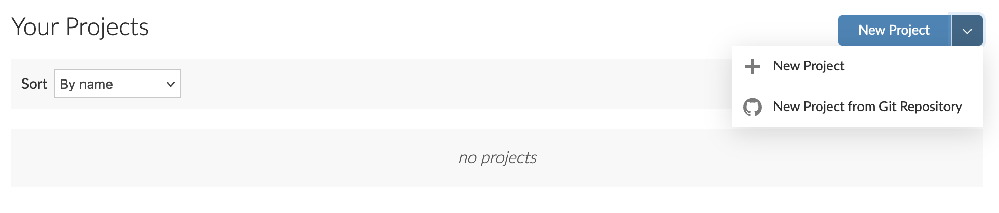

```{r setup, include=FALSE}
options(htmltools.dir.version = FALSE)
knitr::opts_chunk$set(fig.retina = 3, echo = F,
                      cache = F,
                      warning = F,
                      comment = "",
                      dev = "ragg_png",
                      fig.showtext = T,
                      message = F)
library(fontawesome)
library(tidyverse)
library(ptrr)
library(ragg)
library(knitr)
library(flipbookr)

library(xaringanExtra)

ptrr::set_geom_defaults()
ptrr::set_ptrr_ggplot_fonts()
update_geom_defaults("rect", list(fill = "blue"))

options(tibble.print_min = 20)
options(scipen = 99)
```

```{r, include=FALSE}
xaringanExtra::use_xaringan_extra("share_again")

xaringanExtra::style_share_again(
  share_buttons = c("twitter", "linkedin", "pocket")
)

xaringanExtra::use_extra_styles(
  hover_code_line = TRUE,         
  mute_unhighlighted_code = TRUE  
)
```


```{r xaringan-themer, include=FALSE, warning=FALSE}
library(xaringanthemer)
style_mono_accent(
  base_color = "#0000ff",
  header_font_google = google_font("IBM Plex Sans"),
  text_font_google   = google_font("IBM Plex Sans"),
  code_font_google   = google_font("IBM Plex Mono"),
  table_row_even_background_color = "fff"
)
```

```{r fonts, include=FALSE}
ptrr::register_plexsans()
ptrr::register_plexsans_condensed()
```

```{r meta, include=FALSE}
library(metathis)
meta() %>%
  meta_general(
    description = "Description",
    generator = "xaringan and remark.js"
  ) %>% 
  meta_name("github-repo" = "petrbouchal/czecheval2021") %>% 
  meta_social(
    title = "Title",
    url = "https://petrbouchal.xyz/czecheval2021",
    image = "https://petrbouchal.xyz/czecheval2021/slides/twitter_card.png",
    image_alt = "social alt",
    og_type = "website",
    og_locale = "en_UK",
    og_author = "Petr Bouchal",
    twitter_card_type = "summary_large_image",
    twitter_creator = "@petrbouchal"
  ) %>% 
  write_meta("meta.html")
```

class: left, middle, inverse

# Welcome!

---
class: left, large, inverse

# Who I am

social scientist by background

worked in public service, think tanks, consulting

no technical education beyond an economics degree

now focus on quality of institutions, data analysis, public finances

---
class: left, middle, inverse

# Why we are here today

---
class: left, top, large

1\. Code + data = more                                    manageable projects

--

2\. Get a sense of when and why to use R

--

3\. Find our way around R and RStudio

--

4\. Hands-on: common data analysis tasks in R

--

5\. Use R to make data analysis projects manageable

--

6\. Know where to go to learn more

---
class: left, large

# What we are not doing

making you an expert in each of the tools

learning statistics

talking about big data, AI and other buzzwords

---

class: left, middle, inverse, large

# The plan

Motivation: introducing the case study

Manageable data analysis projects

A gentle intro to R

Dissecting the case study: tools & practices

After we part

???

The case study will provide an overview of the core components of the R toolkit:

- writing code
- loading and analysing data
- visualising data
- blending code and text into automated outputs
- organising the project

We don't start with teaching you the syntax and usage of R:

- so we don't get bogged down in detail
- so you understand useful bits in use in the case study (tidyverse)

By the end of today, you won't necessarily understand every line or be able to create it, but you will understand what are the different tools that are needed to build a project like this and where to learn to use them in more depth.

---
class: left, middle, inverse

# But first: light technical setup

---

class: center, middle

.large[

[petrbouchal.xyz/czecheval2021](https://petrbouchal.xyz/czecheval2021)

]

---

class: left, middle, medium

- Go to [rstudio.cloud](https://rstudio.cloud)
- Log in the way you signed up (email, Google account, Github account)
- "New project > New Project from Git Repository"



- enter https://github.com/petrbouchal/czecheval2021

- Run `renv::restore()` in Console

???

https://rstudio.cloud

https://github.com/petrbouchal/czecheval2021

renv::restore()

---
class: left, middle, inverse

# Motivation

---
class: left, middle, large

open `report.Rmd`

click  blue "Knit" button on the toolbar > "Knit to HTML"

???

Output

- text and code
- output: all in one 
- numbers are update automatically

Directory:
- Rmd source
- input data
- output data

Together, these allow you to run what I call manageable projects.

---
class: middle, inverse, large

# *Manageable data analysis projects*
# or 
# what we want from data analysis

---
class: large, middle

Only do valuable work

and do it efficiently

so that you don't go mad,

nor your future self or your colleagues

and so that you can be sure the results are right.

---
class: medium

.pull-left[

## What a good project should be like

- automated
- transparent
- easily tweaked
- easily repeated
- low friction
- (easy to collaborate on in parallel or in sequence)
- (clear history of changes)

]

--

.pull-right[

## What it means in practice

- code + data
- self-contained
- documented
- well organised (code, files, workflow)
- code + text
- (version control)

]

---
class: medium, middle, center

ad-hoc calculation

...

**repeatable/automated report**

reproducible report

...

production data system

???

-There is a spectrum
-There are nuances - replication, repetition, reproducible, automated

In different contexts, you will want different standards, but having at least basic reproducibility (i.e. the code will work if someone else runs in order) is good even for the most basic mini projects.

---

class: large

# Why use R for this

.pull-left.center.middle[

Open source

Flexibility

*Community*

]

.pull-right.center.middle[
Data

Visualisation and reporting

*RStudio*
]

???

Versus Python?

By statistitians, for data

Community = inclusive, ppl. w/varied backgrounds, non-programmers

Versatile: I show you tabular and spatial data, but you can work with anything.

Very good for any kind of modeling.

Used in critical and high-profile applications (science, newsrooms, industry, government).

---

class: middle, inverse, large

# Dissecting the case study

---
class: large

1\. Data + code + text = data analysis

2\. Running code, basic operations

3\. Working with tabular data

4\. Data visualisation

5\. Making projects manageable

---
class: large

**1\. Data + code + text = data analysis**

2\. Running code, basic operations

3\. Working with tabular data

4\. Data visualisation

5\. Making projects manageable

---
class: middle, large

# A tour of your screen

## RStudio

.pull-left[
1. Scripts
1. Console
]

.pull-right[
1. Environment + History
1. Files + Plots + Packages + Help + Viewer
]

???

We will now take a look at simpler examples of the two core components:

- R code
- markdown

---
class: large

1\. Data + code + text = data analysis

**2\. Running code, basic operations**

3\. Working with tabular data

4\. Data visualisation

5\. Making projects manageable
---
class: center, middle, large

open `example.md`

---
class: center, middle, large

open `example.Rmd`

---
class: large

# Core concepts: Markdown + Rmarkdown

.pull-left[
markdown

- plain text
- YAML header
- source versus output
- Visual Editor

]

.pull-right[
Rmarkdown

- code chunk
- chunk options
- inline code
- output formats
- knitting

]

---
class: center, middle, large

open `example.R`

???

Autocomplete => how to name variables

---

class: large

# Aside: seeking help

- `?function` / `??anything`
- click a function in a script, then F1
- "Google the error message"
- Stack Overflow
- RStudio Community
- package documentation: vignettes and online
- [RStudio Cheatsheets](https://rstudio.com/resources/cheatsheets/)

---
class: large, middle, center

# Core concepts: R

.pull-left[
object

function

variable

data.frame
]

.pull-right[
package

script

environment
]

---
class: medium

# Summary: what is what in R

"Only the data and code are real"

.pull-left[

## Persistent/real

- code & text (R or Rmarkdown document)
- input data
- (other input files, like images)

]

.pull-right[

## Transient

- outputs: documents, chart files, output data files
- objects in the R environment

]

see https://socviz.co/gettingstarted.html#things-to-know-about-r

---

### Input data is not altered by code

Data are read from a file into the R environmet.

We use code to operate on the data in the environment, not on the data file.

The result can be written into a new file as needed.

### Everything I do to the data must be recorded in code

No manual editing of the input data files.

No manual editing of output files (only at the end if needed)

The code file should run from start to finish without errors.

### What is in the Environment does not persist

Once R is restarted, it disappears (restart often!)

If you want to keep it, you must have a way of reproducing it with code.

---

class: center, middle, large

Following these principles will make your data work more reproducible.

These also apply to data analysis in  other languages (Python, Julia aj.)

---
class: large

1\. Data + code + text = data analysis

2\. Running code, basic operations

**3\. Working with tabular data**

4\. Data visualisation

5\. Making projects manageable

---
class: large

# Tidyverse: what it is

- set of R packages with consistent usage principles
- built for tabular data (rows and columns)
- grammar analogy: a set of verbs for each type of tasks
- follows logic of data analysis
- can be thought of as extension or dialect of R

---
class: left, top

# Tidyverse: the basic logic
.center.middle[

]

---
class: large

# A package for each set of tasks

.center[
```{r, out.width="60%"}
include_graphics("tidyverse-logos.png")
```
]

---
class: large

# A package for each set of tasks

- `readr` load data from text files (CSV, TSV)
- `readxl`: import data from Excel
- `dplyr`: basic data manipulation
- `tidyr` data cleaning and reshaping
- `stringr`: work with texts ("characters"/"strings")
- `lubridate` work with dates and times
- `ggplot2`: data visualisation

---
class: large, center, middle

[dplyr.tidyverse.org](https://dplyr.tidyverse.org)

[readr.tidyverse.org](https://dplyr.tidyverse.org)

...

Reference | Articles

---

## Further:

- `forcats` for working with factors (categorical data)
- `httr` a `rvest` for accessing and scraping web data
- `tibble` for handling data frames
- `glue` for concatenating strings and data in a neat way
- `purrr` for looping through operations across data

## Even more:

- `haven` for loading SPSS, Stata and other data
- `DBI`, `dbplyr` and friends: interface to databases
- `writexl` for exporting data into excel
- `sf` for working with spatial (geographical) data

---

class: medium

*Verbs* in the tidyverse (`dplyr` and `tidyr` packages)

- `filter`: select rows that fit a rule
- `mutate`: calculate new columns
- `summarise`: summarise using a summary function (sum, mean, ...)
- `group_by`: run operations for each group
- `select`: select columns (as in SQL)
- `arrange`: ordering rows based on one or multiple columns
- `join_*:` join multiple datasets based on a key column
- `pivot_*:` reshaping ("long" <=> "wide" form)

---

class: large

Other useful functions

- `count`
- `starts_with` / `ends_with` / `matches`
- `distinct`
- `n_distinct`
- `rename`
- `recode`
- `separate` / `unite`
- `bind_rows`

---
class: center, middle, large

# Tidy data manipulation

---

```{r}
vd <- readr::read_csv(here::here("data-input/vaccines_cz_daily-doses-NUTS3.csv")) %>% 
  rename(date = datum, vaccine = vakcina, 
         nuts3 = kraj_nuts_kod, 
         nuts3_name = kraj_nazev,
         doses_total = celkem_davek)
```

`r chunk_reveal("tidyverse-example")`
```{r tidyverse-example, eval = FALSE}
vd %>% 
  select(date, vaccine, nuts3, doses_total) %>% #BREAK
  mutate(month = lubridate::floor_date(date, "month")) %>% #BREAK
  group_by(month, vaccine, nuts3) %>% #BREAK
  summarise(doses_total_monthly = sum(doses_total)) %>%  #BREAK
  ungroup() %>%  #BREAK
  group_by(vaccine, nuts3) %>%  #BREAK
  mutate(doses_total_monthly_cum = cumsum(doses_total_monthly)) %>%  #BREAK
  arrange(nuts3, vaccine, month) #BREAK
```

---
class: large

1\. Data + code + text = data analysis

2\. Running code, basic operations

3\. Working with tabular data

**4\. Data visualisation**

5\. Making projects manageable

---
class: center, middle, large


```{r}
vd_reg_month <- vd %>% 
  mutate(month = lubridate::floor_date(date, "month")) %>% 
  # there is a row for each day, so let's group by month
  group_by(month, vaccine, nuts3, nuts3_name) %>%
  summarise(doses_total = sum(doses_total)) %>% 
  ungroup() %>% 
  arrange(month) %>% 
  group_by(vaccine, nuts3, nuts3_name) %>% 
  mutate(doses_total_cum = cumsum(doses_total))
```

# ggplot2: The Grammar of Graphics

---

`r chunk_reveal("ggplot2-example", break_type = "non_seq")`
```{r ggplot2-example, eval = F, echo = F}
ggplot(data = vd_reg_month, #BREAK
       mapping = aes(x = month, 
                     y = doses_total_cum) #BREAK2
) + #BREAK
  geom_col( #BREAK3
    aes(fill = vaccine) #BREAK4
  ) + #BREAK3
  facet_wrap(vars(nuts3_name)) + #BREAK5
  scale_fill_brewer(palette = "Set1") + #BREAK6
  labs(title = "Total doses by region and vaccine type",
       subtitle = "Cumulative monthly totals") + # BREAK7
  theme(
        legend.position = "bottom" #BREAK8
  ) #BREAK

```

---
Assign variables/columns to aestherics in `mapping = aes(...)`; asign fixed values (like `colour = "red"`) outside `aes()`.

.pull-left[
```{r, echo = TRUE, fig.height = 6}
ggplot(data = vd_reg_month,
       mapping = aes(x = month, y = doses_total)) +
  geom_col(aes(fill = vaccine)) #<<
```
]
.pull-right[
```{r, echo = TRUE, fig.height = 6}
ggplot(data = vd_reg_month, 
       mapping = aes(x = month, y = doses_total)) +
  geom_col(fill = "red")  #<<
```
]

---
class: large

1\. Data + code + text = data analysis

2\. Running code, basic operations

3\. Working with tabular data

4\. Data visualisation

**5\. Making projects manageable**

---
class: medium

Think through the purpose: automation, adaptation, repeatability, reproducibility

.pull-left[
## Good practice and discipline

- [naming things](http://www2.stat.duke.edu/~rcs46/lectures_2015/01-markdown-git/slides/naming-slides/naming-slides.pdf) consistently (files, objects, columns)
- make project self-contained
- file organisation
- DRY: do not repeat yourself; reuse code by creating functions
- documenting code + files (comments, README.md)
- consistent coding style

See [this post too](http://www2.stat.duke.edu/~rcs46/lectures_2015/01-markdown-git/slides/naming-slides/naming-slides.pdf) and my [personal set of practices I try to follow](https://petrbouchal.xyz/rcode/).

]

.pull-right[

## Tools

- version control: git + Github
- workflow management: {targets}
- testing and validation
- software reproducibility: {renv}

]

---
class: large, middle, inverse

# What next?

---
class: large

See [workshop page](https://petrbouchal.xyz/czecheval2021) for further resources

RStudio [learning resources](https://education.rstudio.com/learn/beginner/)

[R for Data Science online book](https://r4ds.had.co.nz/)

[\#rstats twitter](https://mobile.twitter.com/search?q=%23rstats&src=hashtag_click)

Do an online course

Learn git + Github (see [happygitwithr.com/](https://happygitwithr.com/))

Working with Czech public data? Check out packages: {[CzechData](https://jancaha.github.io/CzechData)}, {[RCzechia](https://cran.r-project.org/package=RCzechia)}, {[czso](https://cran.r-project.org/package=czso)}

???

https://docs.google.com/forms/d/e/1FAIpQLSemjKMGKcsML5icIT7wfQ01rP5DiXJsYbr0dwJo3nwRHnIhfw/viewform?usp=sf_link

---
class: center, middle, large, inverse

[petrbouchal.xyz/czecheval2021](https://petrbouchal.xyz/czecheval2021)
---

class: inverse, bottom, right, large
layout: false

<a href="https://twitter.com/petrbouchal">`r fa("twitter", fill = "white")`</a> <a href="https://github.com/petrbouchal">`r fa("github", fill = "white")`</a> <a href="https://linkedin.com/in/petrbouchal">`r fa("linkedin", fill = "white")`</a> petrbouchal  
[petrbouchal.xyz](https://petrbouchal.xyz)  
pbouchal@gmail.com


